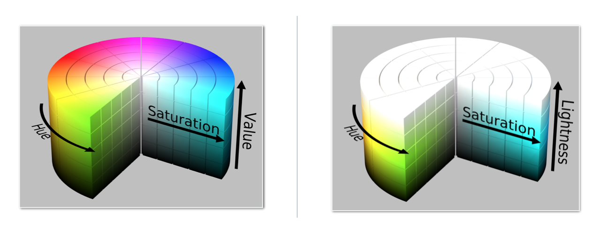
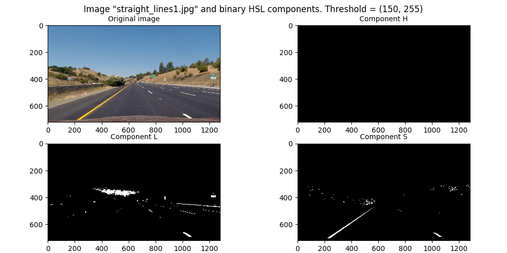
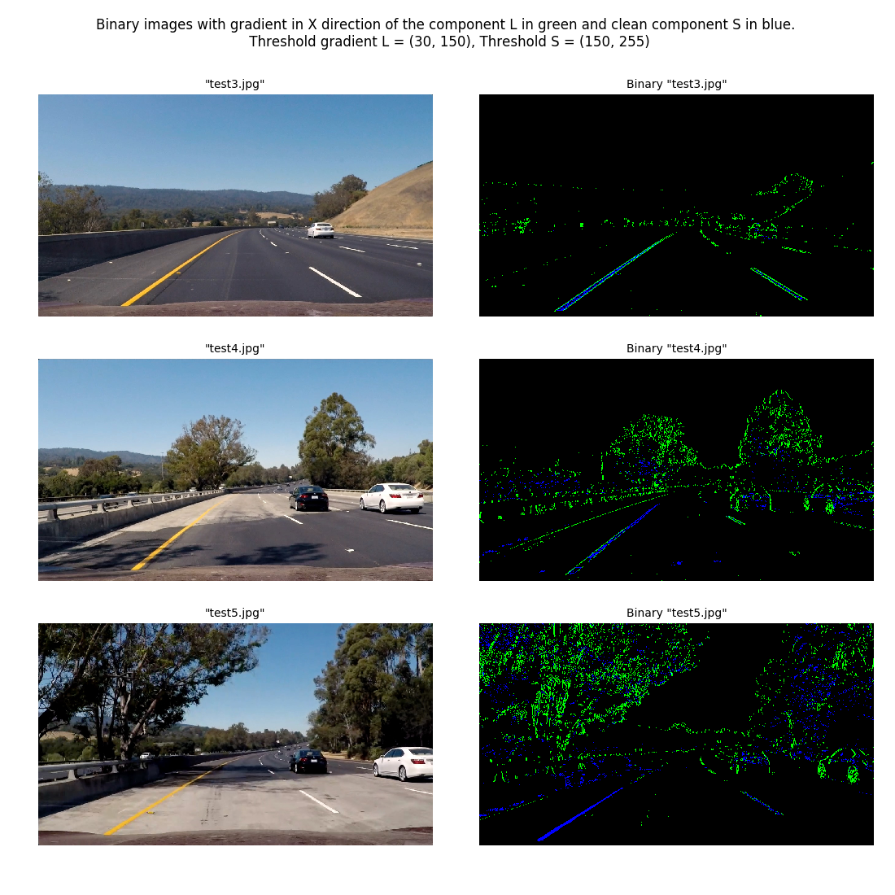
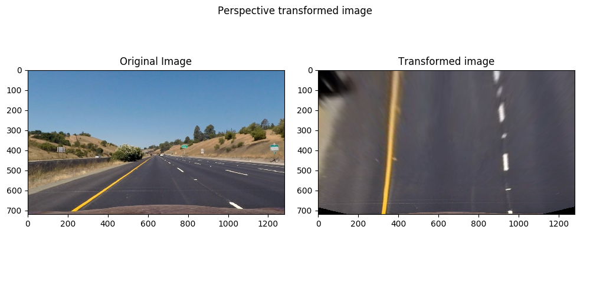
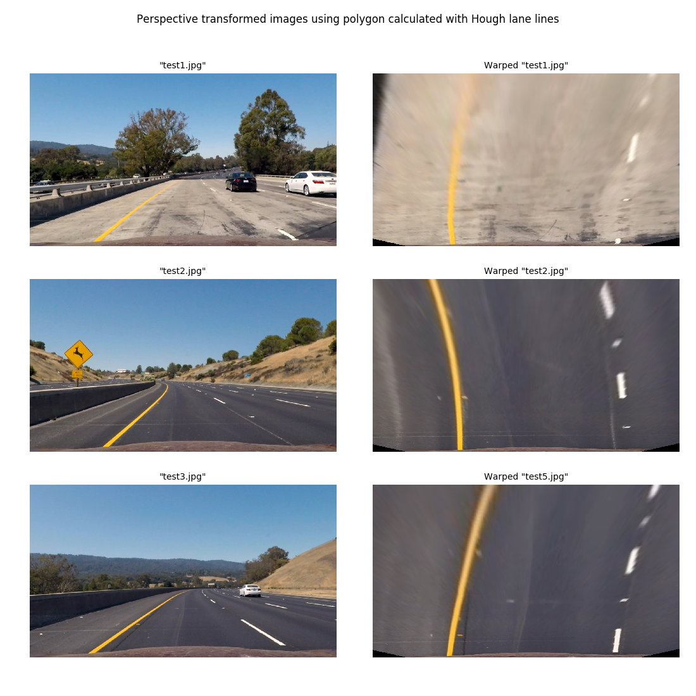
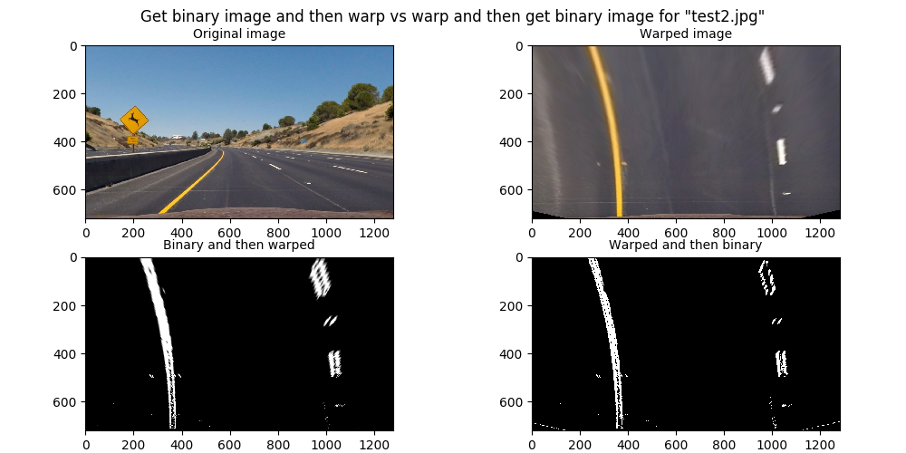
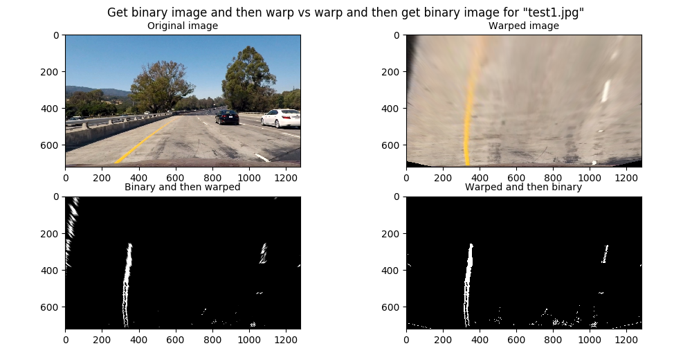
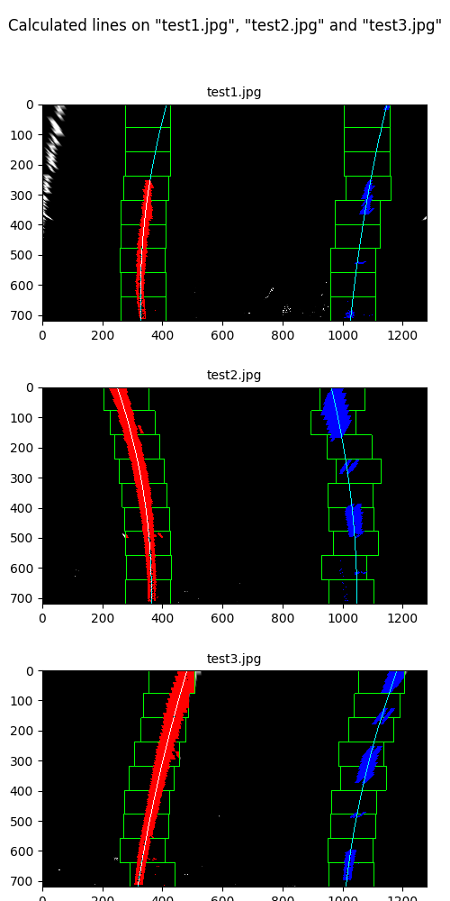
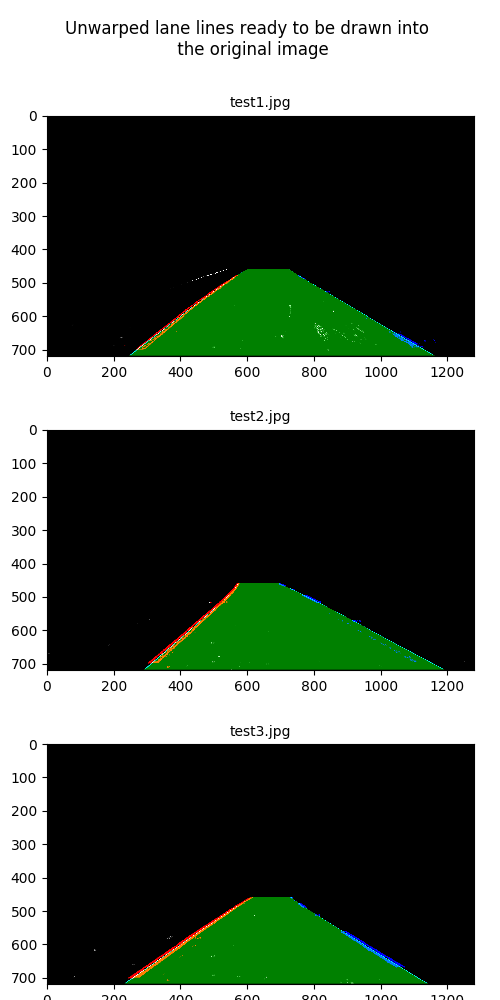
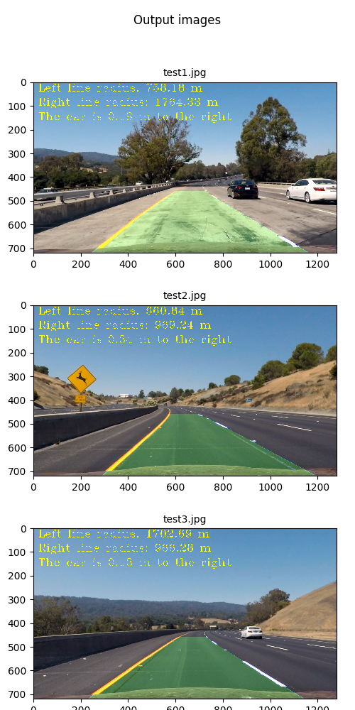

# Self driving car nanodegree
## Project 2: Advanced lane line finding

### Description

This is the second project of the Udacity's nanodegree in autonomous vehicles. In this project advanced concepts of computer vision are used in order to detect lines on the street through a camera and extract some information. For that the library OpenCV is used, together with other Python standard libraries.

For the project a pipeline of functions was developed to be applied first in images and after that in videos. 

The computer vision concepts used on this project are:

- Camera calibration
- Perspective transformation
- Image gradients
- Color spaces HSL and HSV

### Development process on images

#### Camera calibration
The first step in order to extract reliable data from images is to undistort the images taken from it. In order to do that the matrix of the camera and the distortion coeficients are needed. Both of them can be obtained doing a camera calibration process.

In order to calibrate the camera, 20 images of a chess board with different levels and types of distortion where used, as well with different view points.

For that, I created the function "Calibrate" within a class "Camera" (located in the file "Camera.py"). This function takes as input the path where the images are found, together with the number of columns and rows of chessboard corners. 

The function finds these chessboard points in every calibration image using the OpenCV function "findChessboardCorners" and relates its position on the image with points of the "real world" with format (x,y,z), located on a plane with coordinate z = 0. For example, a chessboard point found in the position (230, 480) of an image would be mapped to the point (2,3,0), what means that it corresponds to the second point of the third row of chessboard points on an image.

 Then, it uses the OpenCV function "calibrateCamera" with the location of the points in the image and in the chessboard points matrix and returns the camera matrix and the distortion coeficients.
 
Having the camera matrix and the distortion coeficients, any image can be undistorted using the function "UndistortImage" of the class "Camera". This function uses the OpenCV function "undistort" and returns an undistorted image.

One of the calibration images before and after the calibration can be seen here:


By displaying both images (undistorted and distorted) it can be seen how the undistorting processing worked on the camera. In the case of this camera, the original images are not that distorted, only in the edges a convex distortion can be seen, which is corrected on the undistorted image.

#### Undistort street images
The first step of the pipeline is to undistort the image of the street using the function "UndistortImage". 


By plotting this test image it can be seen that a little bit of the original image is missing on the undistorted image. Also some objects are bigger, but the difference is actually minimal.

#### Binary image for line detection

##### Gradient with grayscale image

This is the trickiest part of this project because it involves testing a lot in order to get a binary image where the lane lines can be seen and the rest is ideally filtered.

First I tried getting the gradient of an image. The gradient corresponds to the change rate of a multidimensional function and in the case of images can be defined as:

$$\triangledown f = \begin{pmatrix}
g _{x}  \\
g _{y}
\end{pmatrix} = \begin{pmatrix}
\frac{\delta f}{\delta x}  \\
\frac{\delta f}{\delta y}
\end{pmatrix}$$

Where:

$ \frac{\delta f}{\delta x} $ : Derivative with respect to x (gradient in the x direction)
$ \frac{\delta f}{\delta y} $ : Derivative with respect to y (gradient in the y direction)

The gradient needs to be applied separately to different channels of an image. Since we are looking for the edges of the lines without thinking about their color, the most straightforward way to get what we want is applying the gradient on a grayscale version of the original image.

On the pixels where the edges of the lane lines are located the gradient in the x direction is high because they represent a big change in the x direction. Since the lines are diagonally displayed on an image of a camera located at the front of a car, the gradient in the y direction will be also high on the edge of the lines.

This gives the idea that getting the magnitude of the gradient, where both directions are considered can be also usefull. The magnitude of the gradient is defined by:

$$ | \triangledown f | = \sqrt{ g _{x} ^{2} + g _{y} ^{2} }$$

The gradient in the direction X or Y of an image can be calculated by applying to it the Sobel operator. As ilustration, the Sobel operator in direction X with kernel size 3 looks like this:

$$ S _{x} = \begin{pmatrix}
-1  &  0  & +1 \\
-2 & 0 & +2 \\
-1 & 0 & +1
\end{pmatrix}$$

In order to apply the Sobel operator, the convolution of it with the image is calculated:

$$ G _{x} = S _{x} * Image $$

This operation can be done with the OpenCV function "Sobel".

A binary image can be created by selecting the pixels where the gradient is within a threshold range. In the next image, this is applied on the image "straight_lines1.jpg" after it being undistorted using the function "Sobel".


By showing all three images can be seen that the lines are better shown on the binary image created by taking the gradient in the X direction. The difference is not that big though. But the gradient in the X direction also sucesses better on filtering the other elements on the image.

Another approach is to create a binary image by calculating the gradient's direction (not to be confused with the gradient on the X direction or in the Y direction). This can be calculated as following:

$$ \Theta = \tan ^{-1} \Big ( \frac {g _{y}}{g _{x}} \Big ) $$


The binary image created by calculating the direction of the gradient shows a lot of noise, but with very good defined lines. This can be useful to mask another binary image, but it will not work as standalone binary image.

##### Gradient with HSL color space

As said before, the gradient of an image needs to be calculated on a channel of it. It is known that a lane line is normally very bright, so, what if we could use that property to get better binary images?

This can be done by exploring the HSL and HSV color spaces.



The HSL and HSV color spaces are other forms to represent an image as digital data different from the traditional RGB format. For this application the space HSL is more interesting, since we can make use of the component L which indicates the "Lightness" of a pixel. Let's see how the HSL components of our test image "straight_lines1.jpg" look like:


Note: here are the components shown as grayscale.

It can be seen that the component L is basically the same than a grayscale image, while the component S is like a "darkened" version of a grayscale image, where some details are deleted. The component H is more intriguing since it represents the core color of a pixel.

The next figure shows binary images of "straight_lines1.jpg" in the direction X, Y and its magnitude using the different channels of the HSL color space.


By showing all the images received can be seen that the channel H is not usefull to draw the lines into the binary images, In it a lot of scenery is detected but the lines not. The channel S does a very good job by detecting the lines, but they are missing sometimes. There is not a big difference between taking the gradient in direction x, y or the magnitude.

On the other hand, the channel L does even a better job than the channel S by detecting the lines, but it also detects some scenery. It must be remembered that all that scenery will not be considered when the line pixels will be detected and calculated, so it could be safely said that the L channel is here the best option to detect the lines. 

Only to try, lets see what we get with the same settings but another theshold range


By increasing the threshold range, it gets more evident that the Channel L, with the gradient in the X direction is the best approach to detect the lines. 
They are drawn very clear and with not that many other irrelevant elements. The binary images created with the channel S are still missing some parts of the 
line.

This can be explained by thinking how the colorspace HSL works. The H component (Hue) corresponds to the value of the base color (red, green, blue, cyan, magenta and yellow), the S component (Saturation) corresponds to the strength of the shown color, and the L (Lightness) corresponds to how close the color is to white. Since the lane lines are normally white or light yellow, they are more easy to detect using the L component because they are very close to white. But what if the line is darker yellow? In that case the channel L can fail to detect the lane lines, but in the channel S, they will still be strong enough.

Another good idea to create a binary image is to use the HSL components purely.



By showing the binary images created thresholding the HSL components can be seen how good the lines are detected by the L and S components. The L component finds still more pieces of the line, but also another parts of the image, so it would not be smart to use it as it is without applying gradient. Specially when the light is very strong, the L component could be very high everywhere, disturbing the line measurements a lot. In the S component with the selected threshold almost only the lines can be seen, so it seems viable to use it to detect the lines.

I defined as standard method to get the binary image as a combination between the gradient in the L channel in the X direction and a thresholed version of the S channel

Let's see how it works on other images:




By applying both methods on all images, can be seen that the combination of both is a very good approach to get the lane lines. What does not get detected by the gradient in direction X of the L component, gets detected with the S component and viceversa. This method will be used to get the lane line points and after that the equations corresponding to the lane lines.

A little optimization was here done with the parameters, the threshold range for the gradient in X was changed from (30, 150) to (35. 175) and the threshold range for the S component was changed from (180, 255) to (180, 250) in order to prevent very strong shadows to appear in the binary image, like in "test5.jpg"

To get binary images based on the gradient of an image I created the function "GradientCalc" in the class "BinaryImg" and to get binary images from pure HSL components I created the function "HSLBinary" in the class "BinaryImg". This can be found on the file "BinaryImg.py"

#### Perspective transformation

The next step in the lane line detection and measurement is to get a "bird view" image of the street. For this I programmed the function "WarpPolygonToSquare" in the class "Camera". This function moves the point of view of the camera in order to get an image where the lane lines can be seen parallel. This function uses the OpenCV functions "getPerspectiveTransform" and "warpPerspective". For the transformation, it uses a polygon with 4 vertices in the origin image and a square in the destiny image and it receives the Y position of the top and bottom points of the polygon and the X position of the four vertices.

By transforming "straight_lines1.jpg" to bird view using arbitrarly selected polygon vertices we get this:



As it can be seen in the images, the perspective transform is working well getting an image in "bird view" perspective. The problem is that the lines are not parallel as they should be. That is because the vertices of the selected polygon were selected very roughly. That the lines are parallel in the bird view image is very important in order to get good calculations after that. So it is needed to get the vertices of that polygon in a precise way.

Here is where the work in the first project can be very useful to calculate those vertices. So we import from the first project functions "region_of_interest", "hough_vertices" and "hough_lines", now located in the file HoughLines.py and we update the "hough_lines" function to return the points at the beginning and at the end of the line. More information about this function on: https://github.com/EarendilAvari/SDCND_Finding_lane_lines

The values of the polygon calculated using this method are ytop = 460, ybottom = 720, xbottomleft = 207, xtopleft = 508, xbottomright = 1103, xtopright = 696. By warping the image again using this value we get this:


By using this method to find the vertices of the conversion polygon the lane lines in the converted image are completely paralel. What means that the conversion is now accurate and appropiate to be used. The best thing is, that this process is not needed in the pipeline, these vertices can be used for any image to convert it into bird view image, so they can be used as parameters within the pipeline.



By showing the three images and their warped version it can be seen how well this polygon does performing the transformation. In all the three images the lines stay parallel, which means that the conversion is valid and can be used for further analysis.

Now that the methods to get a binary image and to warp it into a bird view image are selected, programmed and tested with test images, it is  important to decide: What to do first? get the binary image and then the perspective transform or viceversa?. For that, binary transformed  images of some of the test images in both orders will be created to see which order is better.



For this image can be seen that both results are very similar, but in the warped image before getting the binary image with the lines the right dashed line is not so well defined, also a little detail in the road is stronger detected in that version. Another thing is the car. While by creating first the binary image and then warping it the car does not get detected, but by warping the image and then creating a binary image from it, the car gets detected, what can cause wrong measurements of the lines.

Let's plot the comparison with another image to be sure what option is the best



In the case of this image, it can be seen that the left line gets detected longer in the version where first the binary image is created and then the binary image is warped than in the contrary version. Also in the contrary version some other details of the street are being detected, which are not part of the line. So the better approach may be to get first the binary image and then warp it.

#### Identification of lane lines on perspective transformed binary image

Now it is time to calculate mathematically the lane lines by detecting their pixels on the warped binary images and then interpolate the lines. For that a new class was programmed and tested. The class "LinesProcessing" located in the file "ProcessLines.py", which contains the functions "findFirstLaneLinesPixels", "findNewLaneLinesPixels" and "getLines".

The function "findFirstLaneLinesPixels" is meant to be used on the first frames of a video, or when the lines are completely lost. That is because it makes some very heavy computation, looping all the non zero pixels of the image for every pair of slicing windows. In the normal case this function should only be used for the first frames of a video. It receives as argument the binary perspective transformed image and it returns four arrays containing the position X and Y of the pixels which belong to the 
right and the left line.

In order to detect the lines for a new frame after the lines were detected for the frame before, the function "findNewLaneLinesPixels" should be used. This function uses the polynom coeficients of the lines of the last frame (or an average of a bunch of frames) in order to get the lines of the current frame. It is way faster than the function "findFirstLaneLinesPixels" because it only contains one loop through all non zero pixels of the image. An interesting option is to use the average of the polynomic coeficients of the lines of the last n frames, weighing more the ones of the last frames, getting so more robust calculations

To get the mathematical equations of the lane lines, the function "getLines" is used. This function interpolates the lane lines points found with "findFirstLaneLinesPixels" or with "findNewLaneLinePixels". This function returns the polynomic coeficients of the two lines and the image with the calculated lines and/or the lane drawn on it, if wanted.  

Now let's try the functions "findFirstLaneLinesPixels" on the images "test1.jpg", "test2.jpg" and "test3.jpg".



It can be seen that the functions work very well with these images, getting accurate curves. The only problem here seem to be that the lines are not completelly parallel. 

As said before, in order to get faster processing, the function "findNewLaneLinesPixels" can be used. This function uses the last found polynomial coeficients in order to perform a selective search close to the line defined by the last found polynomial coeficients. Another interesting option is to use the average of the last coeficients found. 

Let's see what happens if we use a weighted average of the polynomial coeficients found before for the three images to get the lane lines on the same three images again. For that, lets wheight the polynomial coefficients of the second image three times stronger than for the other two:


Here it can be seen how the lines tend to be more similar to the other ones because of the ponderation. Specially in the case of "test3.jpg" it can be seen that the lines are inclined more to the left because of the influence of "test2.jpg" whose coeficients are of ponderation 3 of 5. Here gets evident that a very good idea would be to use the coeficients of the last n lines, ponderating stronger the coeficients of the last frames, because they will be more similar to the current frame than the older coeficients.

#### Calculation of the radius of curvature and the position of the car

To calculate the radius of curvature and the position of the car, three new functions were added to the class "LinesProcessing". These functions are "getMeterPolynoms", "calculateCurvatureMeters" and "calculateVehiclePos". The function "getMeterPolynoms" does another interpolation in order to get the polynomic coeficients in metric measurement units. These coeficients are used by the functions "calculateCurvatureMeters" and "calculateVehiclePos" to calculate the radius of curvature of the lines and the position of the car relative to the center of the image. All these three functions use two conversion coefficients from pixels to meters. These coefficients are different between the X and Y coordinates because they are applyed on a perspective transformed image. 

The radius of curvature of a line is calculated with the function "calculateCurvatureMeters" using the following equation:

 $$ Line _{rad} = \frac {1 + (2 \cdot A \cdot Y_{max} \cdot Y_{mPerPix}+ B^{2}) ^{\frac{3}{2}}} {|2 \cdot A|}$$ 
 
where A is the coeficient of the quadratic part of the polynomial and B is the coeficient of its linear part, and Ymax is the value of Y in pixels at the bottom of the image.
 
 The position of the car relative to the center of the image is calculated by the function "calculateVehiclePos" with the following equation:
 
$$X_{car} = X_{leftLine} + \frac{X_{rightLine} - X_{leftLine}}{2} - X_{center} $$
 
calculating before the position X of the lines at the bottom of the image in meters:
 
$$ X _{leftLine} = A _{leftLine} \cdot (Y_{max} \cdot Y_{mPerPix})^{2} + B_{leftLine} \cdot Y_{max} \cdot Y_{mPerPix} + C_{leftLine} $$
 
$$ X _{rightLine} = A _{rightLine} \cdot (Y_{max} \cdot Y_{mPerPix})^{2} + B_{rightLine} \cdot Y_{max} \cdot Y_{mPerPix} + C_{rightLine} $$

And the position X of the center of the image:

$$ X_{center} = (X _{max} \cdot 2) \cdot X_{mPerPix}$$

By calculating these values on the images "Test1.jpg", "Test2.jpg" and "Test3.jpg" the following values are received:

Test1.jpg: Radius left:  758.181109299  [m] Radius right:  1764.32871012  [m] Car position:  0.194052998849  [m]
Test2.jpg: Radius left:  660.840582342  [m] Radius right:  969.242967787  [m] Car position:  0.341771160283  [m]
Test3.jpg: Radius left:  1702.68530516  [m] Radius right:  966.275112692  [m] Car position:  0.125792894689  [m]

The difference between the radius of curvature between the two lines is because they are not completelly parallel. In the case of "Test2.jpg" they are more similar than in the other two because the lines are more similar. This difference can be used in order to determine if the lines found are plausible or not. A difference bigger than 5000 meters for example would indicate that the lines are very different between each other and therefore they should not be considered a reliable measurement.

#### Reverse perspective transformation for image with lanes drawn on it

In order to draw the lane lines into the original undistorted image, two changes where made. The function "getLines" of the class "LinesProcessing" was extended in order to be able to draw a polygon, where the lane lines are located.
Also the function "UnwarpSquareToPolygon" was added to the class "Camera" in order to unwarp the image where the lane lines are drawn. This image will then be added to the original unwarped image. For this image, the same parameters as for the function "WarpPolygonToSquare" are needed.

Let's execute this for the images "test1.jpg", "test2.jpg" and "test3.jpg"



It can be seen that it works pretty well for the three images. Now, the last part of the pipeline. Combine this images with the original, including the radius of curvature and the position of the vehicle

#### Add image with lane lines and data to original undistorted image

In order to get the final image with the lane lines on it and the calculations, the function "addDataToOriginal" was added to the class "LinesProcessing". Let's try it with the 3 test images.



It can be seen that the lane lines are good identified in the three output images, indicating that the pipeline is ready and working well.

#### Validation of the pipeline

Now let's recapitulate what are the steps of the pipeline:
    1. Undistort the image using the function "UndistortImage" of "Camera" and the camera matrix and distortion coeficients obtained with the camera calibration.
    2. Obtain a binary image of the undistorted image by calculating the gradient in direction X of its L color channel using the function "GradientCalc" of the class "BinaryImg". Default threshold range is (35,180).
    3. Obtain a binary image of the undistorted image by thresholding its S color channel using the function "HSLBinary" of the class "BinaryImg".Default threshold range is (180, 250)
    4. Combine both binary images with the function "CombineBinaries" of the class "BinaryImg"
    5. Warp the combined binary image into a "bird view" image with the function "WarpPolygonToSquare" of the class "Camera" using the polygon parameters calculated with the function "hough_lines" created for the first project.
    6. Get the lane lines pixels from the warped binary image using the function "findFirstLaneLinesPixels" of the class "LinesProcessing" if the first frame or an image is being processed. Use the function "findNewLaneLinesPixels" instead, if the lines were identified already on another frame or frames. If wanted, paints the left line pixels red and the right line pixels blue.
    7. Get the coeficients of second grade polynoms which defines the lines with the function "getLines" of the class "LinesProcessing". If wanted draws the lane lines and/or the lane into the image.
    8. Get the coeficients of second grade polynoms which defines the lines in real measurement units with the function "getMeterPolynoms" of the class "LinesProcessing" to be used in order to calculate the radius of curvature of the lines and the position of the car relative to the center.
    9. Calculate the radius of curvature of both lines using the function "calculateCurvatureMeters" of the class "LinesProcessing". 
    10. Calculate the position of the car relative to the center of the image using the function "calculateVehiclePos" of the class "LinesProcessing".
    11. Unwarp the image with the lane lines and the line drawn on it with the function "UnwarpSquareToPolygon" of the class "Camera" using the same parameters used to warp the image on the step 5.
    12. Overlap the unwarped image into the original undistorted image using the function "addDataToOriginal" of the class "LinesProcessing". It also prints the radius of curvature of both lines and the position of the car into the output image.


Let's define here a function which does all the steps.

```
def getStartLaneLines(image, camMatrix, distCoeff, warpParameters, gradXLThresh = (35, 180), SThresh = (180, 250)):
    # Undistort the image using the function "UndistortImage" of "Camera" and the camera matrix and distortion coeficients obtained with 
    # the camera calibration.
    undistImg = cam.UndistortImage(image, camMatrix, distCoeff)
    # Obtain a binary image of the undistorted image by calculating the gradient in direction X of its L color channel using the function 
    # "GradientCalc" of the class "BinaryImg".
    binImgGradX_Lch = binImg.GradientCalc(undistImg, imgType = 'HSL', imgChannel = 'l', calcType = 'dirX', kernelSize = 3, thresh = gradXLThresh)
    # Obtain a binary image of the undistorted image by thresholding its S color channel using the function "HSLBinary" of the class "BinaryImg".
    binImg_Sch = binImg.HSLBinary(undistImg, imgChannel = 's', thresh = SThresh)
    # Combine both binary images with the function "CombineBinaries" of the class "BinaryImg"
    binImage = binImg.CombineBinaries(binImgGradX_Lch, binImg_Sch)
    # Warp the combined binary image into a "bird view" image with the function "WarpPolygonToSquare" of the class "Camera" using the polygon parameters
    # calculated with the function "hough_lines" created for the first project.
    binWarpedImage = cam.WarpPolygonToSquare(binImage, warpParameters[0], warpParameters[1], warpParameters[2], 
                                             warpParameters[3], warpParameters[4], warpParameters[5])
    # Get the lane lines pixels from the warped binary image using the function "findFirstLaneLinesPixels" of the class "LinesProcessing". Paints the left
    # line pixels blue and the right line pixels red
    LeftX, LeftY, RightX, RightY, pixelsBinWarpedImage = linesProc.findFirstLaneLinesPixels(binWarpedImage, showWindows = False, paintLinePixels = True)
    # Get the coeficients of second grade polynoms which defines the lines with the function "getLines" of the class "LinesProcessing". If wanted draws
    # the lane lines and/or the lane into the image.
    leftCoef, rightCoef, laneBinWarpedImage = linesProc.getLines(pixelsBinWarpedImage,LeftX,LeftY,RightX,RightY, drawLines = True, drawLane = True)
    # Get the coeficients of second grade polynoms which defines the lines in real measurement units with the function "getMeterPolynoms" of the class
    # "LinesProcessing" to be used in order to calculate the radius of curvature of the lines and the position of the car relative to the center.
    leftCoefMetric, rightCoefMetric = linesProc.getMeterPolynoms(LeftX,LeftY,RightX,RightY)
    # Calculate the radius of curvature of both lines using the function "calculateCurvatureMeters" of the class "LinesProcessing". 
    radLeft, radRight = linesProc.calculateCurvatureMeters(leftCoefMetric, rightCoefMetric)
    # Calculate the position of the car relative to the center of the image using the function "calculateVehiclePos" of the class "LinesProcessing".
    posCar = linesProc.calculateVehiclePos(leftCoefMetric, rightCoefMetric)
    # Unwarp the image with the lane lines and the line drawn on it with the function "UnwarpSquareToPolygon" of the class "Camera" using
    # the same parameters used to warp the image on the step 5.
    laneUnwarpedImage = cam.UnwarpSquareToPolygon(laneBinWarpedImage, warpParameters[0], warpParameters[1], warpParameters[2], 
                                                  warpParameters[3], warpParameters[4], warpParameters[5])
    # Overlap the unwarped image into the original undistorted image using the function "addDataToOriginal" of the class "LinesProcessing". It also
    # prints the radius of curvature of both lines and the position of the car into the output image.
    imageOutput = linesProc.addDataToOriginal(undistImg, laneUnwarpedImage, radLeft, radRight, posCar)
    
    return imageOutput, leftCoef, rightCoef, radLeft, radRight, posCar
```

And let's try it with 3 other images, "test4.jpg", "test5.jpg" and "test6.jpg"


### Deployment of the pipeline on videos


